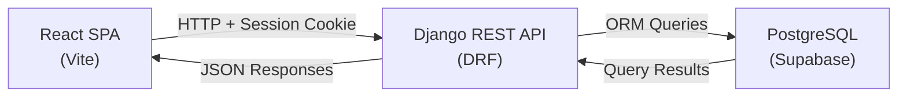
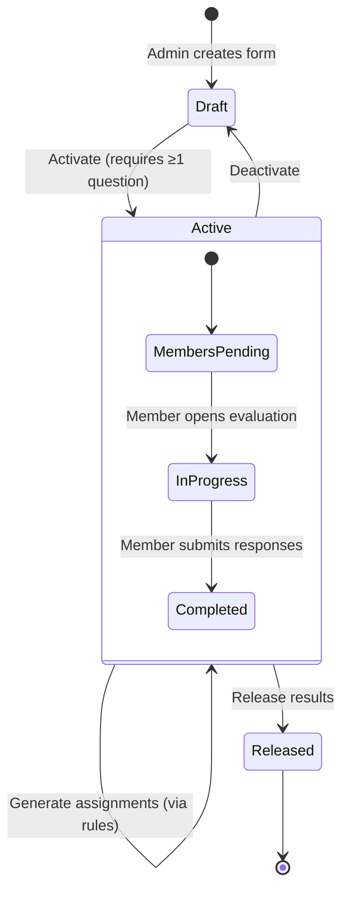
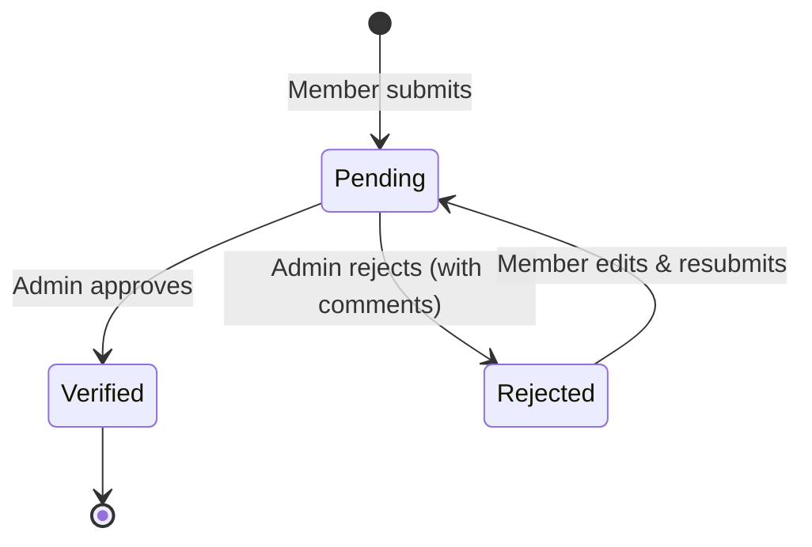

# IPES — Project Manifest

> **Individual Performance Evaluation System**
> Version 1.0 · Last Updated: April 4, 2026

---

## 1. Executive Summary

The **Individual Performance Evaluation System (IPES)** is a full-stack web application designed to digitize, automate, and streamline the peer-evaluation process within student organizations. Originally conceived by the **Committee on Research** of the **CIT-U Supreme Student Government (SSG)**, the system replaces a fragmented, Google Forms–based workflow with a unified, purpose-built platform.

IPES reduces manual effort, eliminates error-prone data collection, and delivers real-time analytics — empowering both evaluators and administrators with actionable performance insights.

---

## 2. Purpose & Problem Statement

### The Problem

The SSG conducts **Individual Performance Evaluations** on a periodic basis to assess officer effectiveness. The legacy process relies on:

- **Google Forms** for evaluation questionnaires — requiring manual creation for each evaluation cycle.
- **Spreadsheets** for response aggregation — a tedious, error-prone, and time-consuming task.
- **Manual distribution** of forms and collection of results — creating bottleneck workloads for administrators.

This approach does not scale. As the number of officers, committees, and evaluation cycles grows, the overhead becomes unsustainable.

### The Solution

IPES provides:

| Capability | Description |
|---|---|
| **Automated Form Distribution** | Evaluation forms are created once and dynamically assigned to the correct evaluator–evaluatee pairs based on configurable rules. |
| **Centralized Response Collection** | All responses flow into a single PostgreSQL database, eliminating scattered spreadsheets. |
| **Real-Time Analytics** | Administrators and members can view scores, trends, category breakdowns, and rankings instantly. |
| **Accomplishment Tracking** | Members maintain a verifiable portfolio of accomplishments that feed into the evaluation context. |
| **Full Audit Trail** | Every critical action (logins, form edits, verifications) is logged with timestamps and IP addresses. |

---

## 3. Technology Stack

```
┌─────────────────────────────────────────────────────┐
│                    FRONTEND                         │
│  React 18  ·  TypeScript  ·  Vite 7  ·  TailwindCSS│
│  shadcn/ui (Radix)  ·  TanStack React Query        │
│  React Router v6  ·  Recharts  ·  React Hook Form   │
│  Zod  ·  dnd-kit  ·  Lucide Icons                  │
├─────────────────────────────────────────────────────┤
│                    BACKEND                          │
│  Django 6.0  ·  Django REST Framework               │
│  Python 3.13+  ·  Gunicorn (production)             │
│  django-cors-headers  ·  python-decouple            │
├─────────────────────────────────────────────────────┤
│                    DATABASE                         │
│  PostgreSQL (hosted on Supabase)                    │
│  SQLite (test runner isolation)                     │
├─────────────────────────────────────────────────────┤
│                    TOOLING                          │
│  Vitest + React Testing Library (frontend)          │
│  Django unittest (backend)  ·  flake8 (linting)     │
│  GitHub Actions (CI)  ·  Pillow (image handling)    │
└─────────────────────────────────────────────────────┘
```

### Key Architectural Decisions

| Decision | Rationale |
|---|---|
| **Session-based authentication** (not JWT) | Simpler CSRF-protected flow; cookies with `SameSite=None` + `Secure` for cross-origin production deployment. |
| **Organization-scoped multi-tenancy** | Each request carries an `X-Organization-Id` header; backend views filter all queries by the active organization. |
| **Soft deletes** | Users, organizations, and evaluation forms are never physically deleted — they are deactivated (`is_active = False` or `is_deleted = True`). |
| **SQLite for tests** | Avoids remote database permission issues and session conflicts; tests run faster in full isolation. |
| **Supabase as managed PostgreSQL** | Zero-ops database hosting with built-in backups, SSL, and dashboard — without coupling to Supabase's client SDK or RLS (all access goes through Django's ORM). |

---

## 4. System Architecture

### 4.1 High-Level Data Flow



### 4.2 Backend App Decomposition

The Django project is organized into **five domain apps**, each encapsulating a bounded context:

```
apps/
├── users/            Authentication, registration, profile management
├── organizations/    Org CRUD, units, positions, memberships, join requests, roles
├── evaluations/      Forms, questions, assignment rules, assignments, responses, analytics
├── portfolio/        Accomplishments (submission, verification, evaluatee profiles)
└── audit/            Immutable audit log with search, export, and statistics
```

#### `apps.users`
- **Custom User model** extending `AbstractUser` with email as the primary identifier (`USERNAME_FIELD = 'email'`).
- **AuthViewSet**: Login, logout, registration (with auto-login), and profile retrieval/update (`/api/auth/me/`).
- **UserViewSet**: Admin-only CRUD for all users, including password reset and soft-delete.

#### `apps.organizations`
- **Organization** — top-level entity with a unique `code` for join-by-code onboarding.
- **UnitType** / **OrganizationUnit** — hierarchical categorization (e.g., Committee, Commission).
- **PositionType** — ranked roles (1 = Head, higher = lower rank).
- **Membership** — ties a user to a unit with a position and date range.
- **OrganizationRole** — Admin vs. Member at the organization level; governs authorization.
- **JoinRequest** — Pending → Approved/Rejected workflow for new member onboarding.
- **Django Signals** — `post_save` on `Membership` auto-generates evaluation assignments for any active forms that match the new member's unit/position.

#### `apps.evaluations`
- **EvaluationForm** — lifecycle: Draft → Active → Results Released (soft-deletable).
- **Question** — supports configurable `input_type`, weighted scoring (`weight`), and range constraints (`min_value`/`max_value`).
- **AssignmentRule** — declarative mapping: "Members of Unit A with Position X evaluate Members of Unit B with Position Y", with self-exclusion.
- **EvaluationAssignment** — concrete evaluator–evaluatee pair for a form. Status: Pending → In Progress → Completed.
- **Response** — individual answer to a question, carrying both `score_value` and optional `text` feedback.
- **Analytics Module** — computes participation rate, category scores, top performers, unit breakdowns, and raw data export.

#### `apps.portfolio`
- **Accomplishment** — a member's logged achievement with proof link and admin verification workflow (Pending → Verified/Rejected).
- **Evaluatee Profile** endpoint — surfaces verified accomplishments during peer evaluations so evaluators have context.
- **Summary Statistics** — counts by status and type, scoped by organization.

#### `apps.audit`
- **AuditLog** — immutable record: user, action string, IP address, timestamp, and optional organization scope.
- **Predefined Action Constants** (`AuditActions`) — 20+ standardized action types covering user, org, form, assignment, and accomplishment events.
- **Rich Query API** — filter by user, action type, date range, IP, or full-text search; export to CSV.
- **Resilient Logging** — `log_action()` catches exceptions silently to never break the main application flow.

### 4.3 Frontend Architecture

```
frontend/src/
├── App.tsx                  Main routing (BrowserRouter, nested layouts)
├── components/
│   ├── layout/              AuthLayout, OfficerLayout, AdminLayout
│   ├── ui/                  shadcn/ui primitives (40+ components)
│   ├── NavLink.tsx           Active-state navigation links
│   ├── ProfileEditorDialog   User profile edit modal
│   ├── theme-provider        Dark/light/system theme switching
│   └── theme-toggle          Theme toggle button
├── contexts/
│   └── OrganizationContext   Global active-organization state (localStorage-persisted)
├── hooks/
│   ├── useApi.ts             Auth-aware query hooks (login, logout, me)
│   ├── useUsers.ts           User CRUD hooks
│   ├── useOrganizations.ts   Organization hooks
│   ├── useEvaluations.ts     Evaluation hooks
│   ├── usePortfolio.ts       Accomplishment hooks
│   ├── useAudit.ts           Audit log hooks
│   └── evaluations/          Sub-hooks for forms, questions, assignments, rules
├── lib/
│   └── api.ts                Centralized fetch wrapper with CSRF, org-header, error handling
└── pages/
    ├── Login / Register / SelectOrganization / Index / NotFound
    ├── officer/              Member-facing views (Dashboard, Evaluations, Results, Accomplishments)
    └── admin/                Admin views (Dashboard, Organization, FormBuilder, Assignments,
                              Analytics, Accomplishments, Users, AuditLog, Settings)
```

#### Role-Based Routing

| Path Prefix | Role | Description |
|---|---|---|
| `/member/*` | Member | Personal dashboard, pending evaluations, submitted results, own accomplishments |
| `/admin/*` | Admin | Full administrative control — org settings, form builder, assignment management, analytics, audit log |
| `/admin/my-*` | Admin (as Member) | Admin users can also access their own member-facing views ("My Space") from the admin layout |

---

## 5. Core Methodologies

### 5.1 Evaluation Lifecycle

The system implements a **four-phase evaluation lifecycle**:



1. **Form Creation & Question Authoring** — Admin creates a form, adds weighted questions with configurable input types, and orders them via drag-and-drop.
2. **Assignment Rules & Generation** — Admin defines declarative rules mapping evaluator groups to evaluatee groups. The system generates the cartesian product of matching memberships, respecting self-exclusion.
3. **Evaluation Response** — Members see their pending evaluations, fill in score-based and text-based responses, and submit. Weighted scores are calculated server-side.
4. **Results Release & Performance Analytics** — Admin releases results; members view their aggregate performance: overall score, category breakdowns, feedback comments, and historical trends.

### 5.2 Rule-Based Assignment Generation

Assignment rules use declarative filters instead of manual pair selection:

```
AssignmentRule:
  evaluator_unit     = "Committee on Research"     (or NULL = all units)
  evaluator_position = "Member"                    (or NULL = all positions)
  evaluatee_unit     = "Committee on Research"      (or NULL = all units)
  evaluatee_position = NULL                         (all positions)
  exclude_self       = True
```

When "Generate Assignments" is triggered:

1. Query all active memberships matching the **evaluator** side filters.
2. Query all active memberships matching the **evaluatee** side filters.
3. Create `EvaluationAssignment` for each `(evaluator, evaluatee)` pair, skipping self-pairs if `exclude_self = True`.
4. Pairs are idempotent — `get_or_create` ensures no duplicates.

### 5.3 Dynamic Assignment via Signals

When a new `Membership` is created or re-activated, a Django signal (`post_save`) automatically checks all active evaluation forms in the organization and applies matching rules — meaning **new members are instantly assigned** to any ongoing evaluations without admin intervention.

### 5.4 Weighted Score Calculation

When an evaluation is submitted:

```
total_score = Σ(response.score_value × question.weight) / Σ(question.weight)
```

This normalized weighted average is stored on the `EvaluationAssignment.total_score` field and used for all analytics aggregations.

### 5.5 Multi-Tenant Organization Scoping

Every API request carries an `X-Organization-Id` header (set from the frontend's `OrganizationContext`). Backend views filter all querysets by this organization, ensuring:

- Members only see data within their organization.
- Admins only manage their own organization.
- Audit logs are scoped per-organization.

### 5.6 Accomplishment Verification Workflow



Verified accomplishments are surfaced during evaluations via the **evaluatee profile** endpoint, giving evaluators context about whom they are assessing.

---

## 6. Data Model Summary

The system is built on **12 core tables** organized across three domains:

### Organizational Structure
| Table | Purpose |
|---|---|
| `Organization` | Top-level entity with unique code, period dates, and active status |
| `UnitType` | Lookup table for unit categories (Committee, Commission, etc.) |
| `OrganizationUnit` | Named subdivision within an organization |
| `PositionType` | Ranked position definitions (Head = 1, Vice Head = 2, etc.) |
| `Membership` | User ↔ Unit ↔ Position binding with date range |
| `OrganizationRole` | User ↔ Organization role (Admin or Member) |
| `JoinRequest` | Membership application workflow |

### Evaluation Engine
| Table | Purpose |
|---|---|
| `EvaluationForm` | Form definition with lifecycle state (draft, active, released) |
| `Question` | Individual question with type, weight, order, and range constraints |
| `AssignmentRule` | Declarative evaluator ↔ evaluatee mapping |
| `EvaluationAssignment` | Concrete evaluator–evaluatee pair with status and total score |
| `Response` | Individual answer to a question (numeric score + text feedback) |

### Portfolio & Audit
| Table | Purpose |
|---|---|
| `Accomplishment` | Member achievement with proof link and verification status |
| `AuditLog` | Immutable event record (user, action, IP, timestamp, org) |

---

## 7. API Surface

All endpoints are prefixed with `/api/` and require session authentication (except login/register). The API follows RESTful conventions via DRF ViewSets with custom actions.

### Endpoint Categories

| Category | Base Path | Key Actions |
|---|---|---|
| **Auth** | `/api/auth/` | `login/`, `logout/`, `register/`, `me/` |
| **Users** | `/api/users/users/` | CRUD, `{id}/set-password/` |
| **Organizations** | `/api/organizations/organizations/` | CRUD, `join_by_code/`, `remove-member/`, `set-member-role/`, `delete-organization/`, `unit_completion_stats/`, `analytics_summary/` |
| **Units** | `/api/organizations/units/` | CRUD |
| **Unit Types** | `/api/organizations/unit-types/` | CRUD |
| **Positions** | `/api/organizations/positions/` | CRUD |
| **Memberships** | `/api/organizations/memberships/` | CRUD |
| **Join Requests** | `/api/organizations/join-requests/` | CRUD, `{id}/approve/`, `{id}/reject/` |
| **Forms** | `/api/evaluations/forms/` | CRUD, `{id}/activate/`, `{id}/deactivate/`, `{id}/release_results/`, `{id}/duplicate/`, `{id}/analytics/`, `{id}/questions/`, `{id}/completed_count/` |
| **Questions** | `/api/evaluations/questions/` | CRUD, `bulk_create/` |
| **Assignment Rules** | `/api/evaluations/rules/` | CRUD, `generate/` |
| **Assignments** | `/api/evaluations/assignments/` | CRUD, `my_pending/`, `my_completed/`, `my_performance/`, `{id}/submit/`, `{id}/responses/` |
| **Responses** | `/api/evaluations/responses/` | CRUD, `bulk_create/` |
| **Accomplishments** | `/api/portfolio/accomplishments/` | CRUD, `my/`, `pending/`, `verified/`, `rejected/`, `by_type/`, `summary/`, `{id}/verify/`, `evaluatee_profile/` |
| **Audit** | `/api/audit/audit/` | Read-only, `recent/`, `today/`, `this_week/`, `by_user/`, `by_action/`, `by_date/`, `search/`, `stats/`, `export_csv/` |

---

## 8. Analytics & Outcomes

### What IPES Produces

| Output | Description |
|---|---|
| **Overall Score** | Weighted average across all evaluators for a given form/member |
| **Category Scores** | Per-question average, enabling granular skill assessment |
| **Top Performers** | Ranked list of evaluatees by average score, grouped by unit |
| **Unit Breakdown** | Aggregated performance and completion rates per organizational unit |
| **Participation Rate** | Percentage of completed assignments out of total generated |
| **Evaluation History** | Cross-form trend analysis showing performance over multiple cycles |
| **Feedback Comments** | Anonymized text responses categorized as positive, constructive, or informational |
| **Raw Data Export** | Full response-level data in structured JSON (exportable to CSV via audit) |

### Dashboards

- **Admin Dashboard** — Organization-wide KPIs: total members, units, assignments, completion rate, and unit completion charts.
- **Admin Analytics** — Form-specific deep-dive: category radar, top performers, unit pie charts, raw data table.
- **Member Dashboard** — Personal summary: pending evaluations count, submitted count, performance preview.
- **Member Results** — Personal performance report with score gauge, category breakdown, feedback list, and historical trend chart.

---

## 9. Security Model

| Layer | Implementation |
|---|---|
| **Authentication** | Django session-based auth with CSRF protection |
| **Authorization** | Role-based: Admin vs. Member per organization (`OrganizationRole`) |
| **CSRF** | Token extracted from cookie; passed via `X-CSRFToken` header on every mutation |
| **CORS** | Whitelisted origins; `credentials: include` for cross-origin cookie support |
| **Production Cookies** | `SameSite=None`, `Secure=True`, `HttpOnly` for session cookies |
| **Soft Deletes** | No physical data destruction; all entities can be deactivated and audited |
| **Audit Trail** | Every significant action logged with user ID, IP address, and timestamp |
| **Input Validation** | Zod (frontend) + DRF serializer validation (backend) |
| **Password Security** | Django's built-in password hashing (PBKDF2-SHA256) with 4 validators |

---

## 10. Testing Strategy

### Backend
- **Framework**: Django's built-in `unittest` + `TestCase`
- **Database**: Auto-switches to SQLite during `test` runs for speed and isolation
- **Coverage**: Model tests (field validation, constraints) and view tests (API endpoint behavior, permissions)
- **Apps Tested**: `users`, `organizations`, `evaluations`

### Frontend
- **Framework**: Vitest + React Testing Library + jsdom
- **Approach**: Component-level tests simulating user interactions
- **Execution**: `npm run test` (headless) or `npm run test:ui` (interactive browser dashboard)

### CI/CD
- **GitHub Actions** workflows:
  - `pr-validate.yml` — Runs backend and frontend tests on pull requests
  - `pr-branch-check.yml` — Validates PR branch naming conventions
  - `stale.yml` — Auto-closes stale issues and pull requests
- **PR Template** — Structured checklist enforcing code review, testing, and documentation standards

---

## 11. Deployment Architecture

```
┌──────────────────┐       ┌───────────────────┐       ┌─────────────────┐
│  React SPA       │──────▶│  Django + Gunicorn│──────▶│  Supabase       │
│  (Static Hosting)│       │  (Render / VM)    │       │  (PostgreSQL)   │
│  Vite build      │       │  Port 8000        │       │  SSL + Backups  │
└──────────────────┘       └───────────────────┘       └─────────────────┘
```

- **Frontend**: Built with `vite build`; static assets served from any CDN or static host.
- **Backend**: Served via Gunicorn behind a reverse proxy; environment configured via `.env` file using `python-decouple`.
- **Database**: Supabase-managed PostgreSQL with SSL (`sslmode=require` in production).

---

## 12. Project Structure

```
IPES/
├── .github/                     CI/CD workflows, PR template, issue templates
├── apps/                        Django backend applications
│   ├── audit/                   Audit logging system
│   │   ├── models.py            AuditLog model
│   │   ├── utils.py             log_action() helper + AuditActions constants
│   │   ├── views.py             ReadOnly ViewSet with search, stats, CSV export
│   │   ├── serializers.py       Log serialization
│   │   └── tests/               Unit tests
│   ├── evaluations/             Core evaluation engine
│   │   ├── models.py            Form, Question, AssignmentRule, Assignment, Response
│   │   ├── serializers.py       Rich serializers with nested data
│   │   ├── views/
│   │   │   ├── forms.py         Form lifecycle (activate, deactivate, release, duplicate)
│   │   │   ├── questions.py     Question CRUD + bulk create
│   │   │   ├── rules.py         Rule CRUD + assignment generation
│   │   │   ├── assignments.py   Assignment CRUD + submit + performance analytics
│   │   │   ├── responses.py     Response CRUD + bulk create
│   │   │   └── analytics.py     Comprehensive analytics computation
│   │   └── tests/               Model + view tests
│   ├── organizations/           Organizational structure
│   │   ├── models.py            Organization, Unit, Position, Membership, Role, JoinRequest
│   │   ├── serializers.py       Nested serializers with computed fields
│   │   ├── signals.py           Auto-assignment on membership activation
│   │   ├── views/
│   │   │   ├── organizations.py Org CRUD + join-by-code + member management + analytics
│   │   │   ├── units.py         Unit CRUD
│   │   │   ├── positions.py     Position CRUD
│   │   │   ├── memberships.py   Membership CRUD
│   │   │   └── join_requests.py Join request approval workflow
│   │   └── tests/               Model + view tests
│   ├── portfolio/               Accomplishment tracking
│   │   ├── models.py            Accomplishment model
│   │   ├── serializers.py       5 purpose-specific serializers
│   │   └── views/
│   │       └── accomplishments.py  Full CRUD + verify + summary + evaluatee profile
│   └── users/                   User management
│       ├── models.py            Custom User (email-primary)
│       ├── permissions.py       IsAdmin permission class
│       ├── serializers.py       Login, register, profile update, password reset
│       ├── views.py             AuthViewSet + UserViewSet
│       └── tests/               Model + view tests
├── frontend/                    React SPA
│   ├── src/
│   │   ├── components/          Reusable UI (shadcn/ui + custom)
│   │   ├── contexts/            OrganizationContext (global state)
│   │   ├── hooks/               TanStack Query hooks for every API domain
│   │   ├── lib/                 API client with CSRF + org-header injection
│   │   ├── pages/
│   │   │   ├── admin/           9 admin pages (Dashboard, FormBuilder, Analytics, etc.)
│   │   │   └── officer/         5 member pages (Dashboard, Evaluations, Results, etc.)
│   │   └── App.tsx              Route definitions with nested layouts
│   ├── package.json             Dependencies and scripts
│   ├── tailwind.config.ts       Design system tokens
│   ├── vite.config.ts           Dev server and build configuration
│   └── vitest.config.ts         Test runner configuration
├── IPES/                        Django project core
│   ├── settings.py              All configuration (DB, auth, CORS, CSRF, DRF)
│   ├── urls.py                  Root URL routing to all apps
│   └── api.py                   API root endpoint listing all available routes
├── scripts/                     Utility scripts for testing and verification
├── manage.py                    Django CLI entry point
├── requirements.txt             Python dependencies
└── sample.env                   Environment variable template
```

---

## 13. Development Workflow

### Getting Started

```bash
# 1. Clone & enter
git clone https://github.com/rkSp4/IPES.git && cd IPES

# 2. Backend setup
python -m venv .venv && .venv\Scripts\Activate.ps1
pip install -r requirements.txt
cp sample.env .env                 # Edit with your DB credentials

# 3. Database
python manage.py migrate
python manage.py createsuperuser

# 4. Frontend setup
cd frontend && npm install
cp .env.example .env.local         # Set VITE_API_BASE_URL

# 5. Run both servers
# Terminal 1: python manage.py runserver
# Terminal 2: cd frontend && npm run dev
```

### Contribution Standards

- **PR Branch Checks** — Automated enforcement of branch naming conventions.
- **PR Validation** — Backend and frontend tests run automatically on every pull request.
- **Structured PR Template** — Requires description, type classification, test evidence, and a compliance checklist.
- **Stale Issue Management** — Automated cleanup of inactive issues and PRs.

---

## 14. Glossary

| Term | Definition |
|---|---|
| **Organization** | A student government body or association that uses IPES |
| **Unit** | A subdivision within an organization (e.g., Committee on Research) |
| **Position** | A ranked role within a unit (e.g., Head, Vice Head, Member) |
| **Membership** | The binding of a user to a unit with a specific position |
| **Evaluation Form** | A questionnaire template containing weighted questions |
| **Assignment Rule** | A declarative filter that maps evaluator groups to evaluatee groups |
| **Evaluation Assignment** | A concrete instance pairing one evaluator with one evaluatee for a specific form |
| **Response** | An individual answer (score and/or text) to a single question |
| **Accomplishment** | A self-reported member achievement with proof, subject to admin verification |
| **Audit Log** | An immutable record of a significant system event |

---

*This manifest captures the essence of IPES as of its current state. It is intended to serve as the canonical reference document for onboarding, architecture review, and stakeholder communication.*
