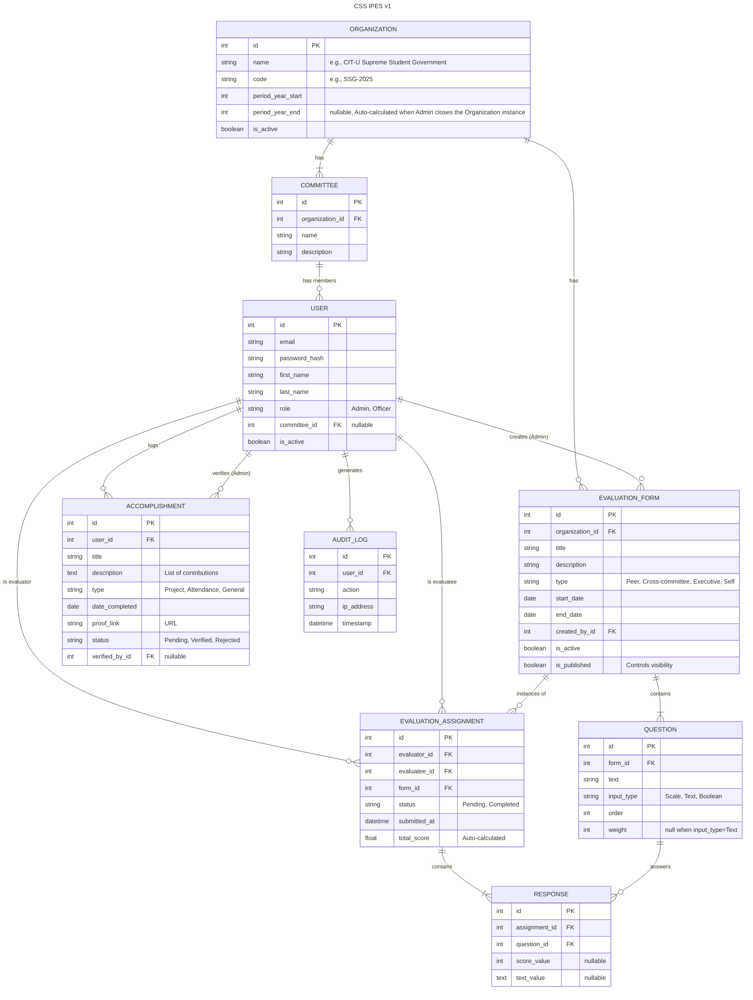

# IPES
The IPES is an evaluation system by the Committee on Research of the CIT-U Supreme Student Government. It is done through Google Forms, but this makes workload heavy both for officers answering and the ones handling the results. 

We provide a solution that will unify the system and reduce the cumbersome process by developing a dedicated, automated evaluation platform tailored to IPES. This system will streamline form distribution, response collection, and result analysis. 
We hope that this system willl help in minimizing manual effort, reducing errors, and providing real-time insights for both evaluators and administrators.

## Tech stack
- Back-end: Django
- Front-end: ReactJS
- Database: Supabase

## ERD

