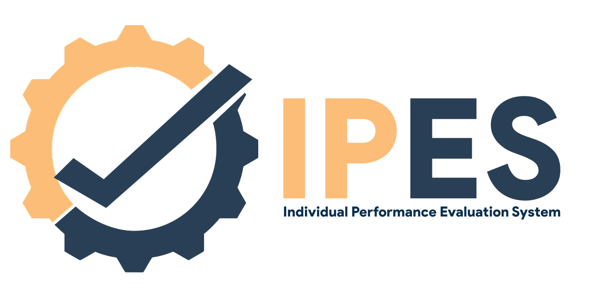
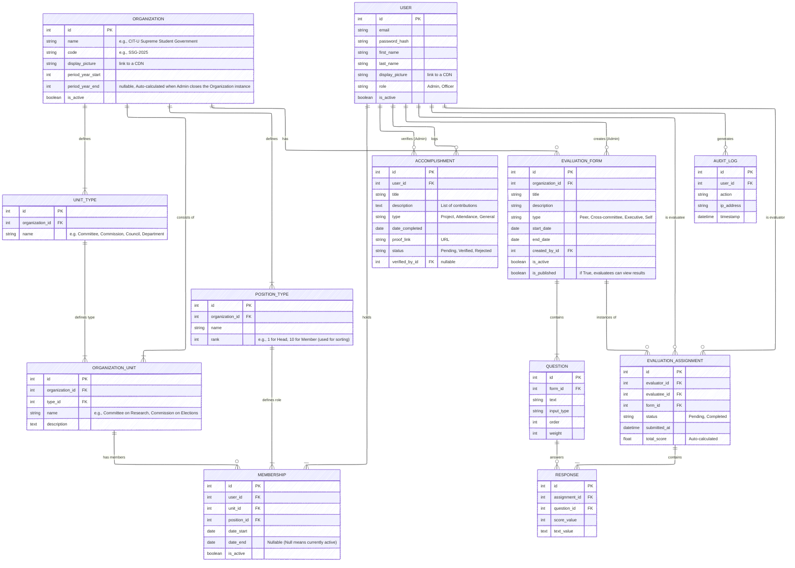

---
# IPES
The Individual Performance Evaluation System (IPES) is an evaluation system by the Committee on Research of the CIT-U Supreme Student Government. It is done through Google Forms, but this makes workload heavy both for officers answering and the ones handling the results. 

We provide a solution that will unify the system and reduce the cumbersome process by developing a dedicated, automated evaluation platform tailored to IPES. This system will streamline form distribution, response collection, and result analysis. 
We hope that this system willl help in minimizing manual effort, reducing errors, and providing real-time insights for both evaluators and administrators.

---
## Tech stack
- Back-end: Django
- Front-end: ReactJS
- Database: Supabase

---
## ERD


---

## 📦 Requirements
- Python 3.10+
- Virtual environment (recommended: `venv`)
- Database (MySQL)

---

## 🛠️ Setup Instructions

### 1. Clone the Repository
```bash
git clone https://github.com/rkSp4/IPES.git
cd IPES
```

### 2. Create Virtual Environment
```bash
python -m venv .venv
```

Activate it:
- **Windows (PowerShell):**
  ```bash
  .venv\Scripts\Activate.ps1
  ```
- **Windows (Command Prompt)**
  ```cmd
  .venv\Scripts\activate.bat
  ```
- **macOS/Linux:**
  ```bash
  source .venv/bin/activate
  ```

### 3. Install Dependencies
```bash
pip install -r requirements.txt
```

### 4. Environment Variables
Copy the example environment file:
```bash
cp sample.env .env
```

Edit `.env` and update with your local secrets (e.g. database, secret key, debug mode).

---

## 🔑 Environment Variables

Your `.env` file should look like this:
```env
SECRET_KEY=mysecretkey
DEBUG=True
DB_NAME=IPES
DB_USER=root
DB_PASSWORD=12345
DB_HOST=127.0.0.1
DB_ROOT=3306
```
Generate your secret key [here](https://djecrety.ir/).
> ⚠️ Never commit `.env` — it contains sensitive information.

---

## 🗄️ Database Setup

1. Apply migrations:
   ```bash
   python manage.py migrate
   ```
2. Create a superuser:
   ```bash
   python manage.py createsuperuser
   ```
---

## ▶️ Running the Server
```bash
python manage.py runserver
```

Visit: [http://127.0.0.1:8000](http://127.0.0.1:8000)

---
