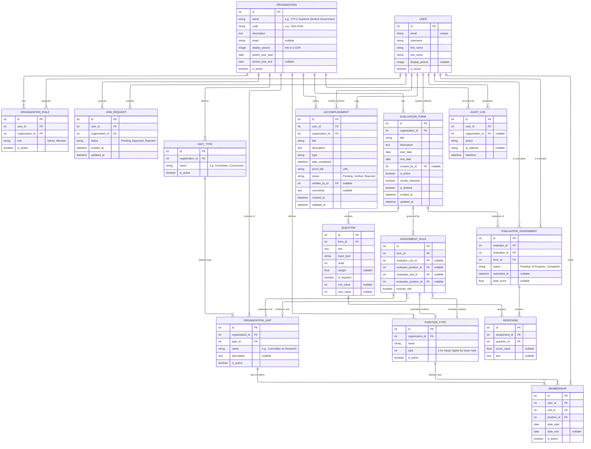

---
# IPES
The Individual Performance Evaluation System (IPES) is an evaluation system by the Committee on Research of the CIT-U Supreme Student Government. It is done through Google Forms, but this makes workload heavy both for officers answering and the ones handling the results. 

We provide a solution that will unify the system and reduce the cumbersome process by developing a dedicated, automated evaluation platform tailored to IPES. This system will streamline form distribution, response collection, and result analysis. 
We hope that this system will help in minimizing manual effort, reducing errors, and providing real-time insights for both evaluators and administrators.

---
## Tech stack
- Back-end: Django
- Front-end: ReactJS
- Database: Supabase

---
## ERD


---

## 📦 Requirements

### Backend
- Python 3.13+
- Virtual environment
- Database (PostgreSQL)

### Frontend
- Node.js 18+ and npm (or yarn/pnpm)
- Modern web browser

---

## 🛠️ Setup Instructions

### 1. Clone the Repository
```bash
git clone https://github.com/CIT-U-Computer-Students-Society-2526/IPES.git
cd IPES
```

### 2. Create Virtual Environment
```bash
python -m venv .venv
```

Activate it:
- **Windows (PowerShell):**
  ```bash
  .venv\Scripts\Activate.ps1
  ```
- **Windows (Command Prompt)**
  ```cmd
  .venv\Scripts\activate.bat
  ```
- **macOS/Linux:**
  ```bash
  source .venv/bin/activate
  ```

### 3. Install Backend Dependencies
```bash
pip install -r requirements.txt
```

### 4. Setup Frontend

Navigate to the frontend directory:
```bash
cd frontend
```

Install frontend dependencies:
```bash
npm install
```

Create frontend environment file:
```bash
cp .env.example .env.local
```

Edit `frontend/.env.local` and set your API base URL (default: `http://localhost:8000/api`)

Return to project root:
```bash
cd ..
```

### 5. Environment Variables
Copy the example environment file:
```bash
cp sample.env .env
```

Edit `.env` and update with your local secrets (e.g. database, secret key, debug mode).

---

## 🔑 Environment Variables

### Backend (`.env`)

Your `.env` file should look like this:
```env
SECRET_KEY=mysecretkey
DEBUG=True
DB_NAME=IPES
DB_USER=root
DB_PASSWORD=12345
DB_HOST=127.0.0.1
DB_PORT=5432
```

Generate your secret key [here](https://djecrety.ir/).
> ⚠️ Update the database credentials to match your database configuration (e.g., Supabase PostgreSQL).

### Frontend (`frontend/.env.local`)

```env
VITE_API_BASE_URL=http://localhost:8000/api
```

> ⚠️ Never commit `.env` or `.env.local` — they contain sensitive information.

---

## 🗄️ Database Setup

Supabase uses PostgreSQL. Connect to your Supabase database and run:

1. Apply migrations:
   ```bash
   python manage.py migrate
   ```
2. Create a superuser:
   ```bash
   python manage.py createsuperuser
   ```
---

## 🧪 Testing the Application

The project uses Django's built-in testing framework for the backend and Vitest/React Testing Library for the frontend.

### Backend Tests
To run the backend tests, assure your environment is set up and your database is accessible.

```bash
# Run all backend tests
python manage.py test

# Run tests for specific apps
python manage.py test apps.users apps.organizations
```
> **Note:** Django creates a separate `test_` database for tests. If you are prompted to destroy an old test database, type `yes`. Ensure you don't have active database client connections (like PgAdmin/DBeaver) to the test database, or it may hang.

### Frontend Tests
The frontend uses Vitest for rapid execution and React Testing Library for simulating user interactions.

```bash
cd frontend

# Run frontend tests in the console
npm run test

# Run tests with a visual, interactive dashboard in your browser
npm run test:ui
```

---

## ▶️ Running the Application

### Development Mode

You need to run both the Django backend and React frontend servers simultaneously.

#### Terminal 1 - Django Backend
```bash
python manage.py runserver
```
Backend will be available at: [http://127.0.0.1:8000](http://127.0.0.1:8000)

#### Terminal 2 - React Frontend
```bash
cd frontend
npm run dev
```
Frontend will be available at: [http://localhost:8080](http://localhost:8080)

### Production Build

To build the frontend for production:
```bash
cd frontend
npm run build
```

The built files will be in `frontend/dist/` and can be served by Django static files or a web server.

---

## 📁 Project Structure

```
IPES/
├── apps/              # Django apps (backend)
│   ├── audit/
│   ├── evaluations/
│   ├── organizations/
│   ├── portfolio/
│   └── users/
├── frontend/          # React application (frontend)
│   ├── src/
│   │   ├── components/
│   │   ├── pages/
│   │   └── lib/
│   └── package.json
├── IPES/              # Django project settings
├── manage.py
└── requirements.txt
```

---

## 🔌 API Endpoints

The Django REST Framework API is available at `/api/`. API endpoints will be added as you develop the backend functionality.

Example API structure:
- `/api/users/` - User management
- `/api/evaluations/` - Evaluation forms and responses
- `/api/organizations/` - Organization management
- etc.

---
