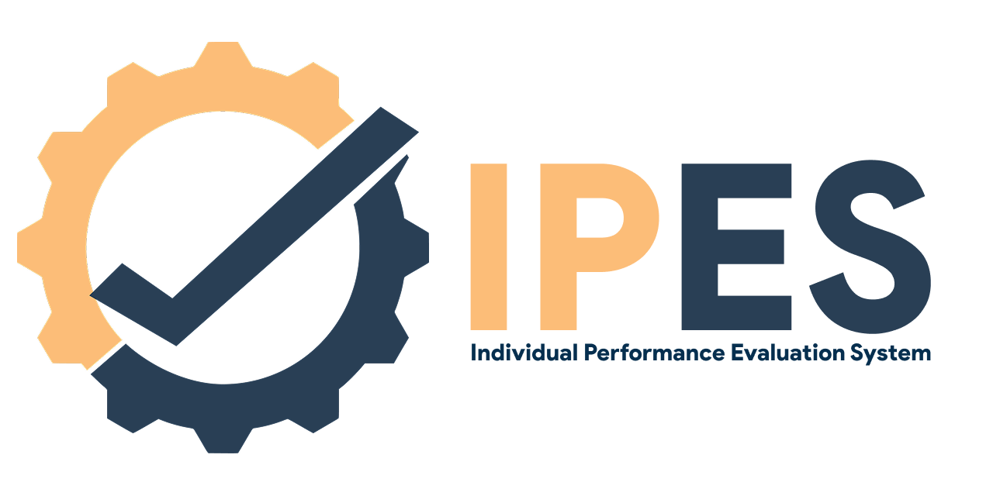

---

# IPES

The Individual Performance Evaluation System (IPES) is an evaluation system by the Committee on Research of the CIT-U Supreme Student Government. It is done through Google Forms, but this makes workload heavy both for officers answering and the ones handling the results. 

We provide a solution that will unify the system and reduce the cumbersome process by developing a dedicated, automated evaluation platform tailored to IPES. This system will streamline form distribution, response collection, and result analysis. 

We hope that this system will help in minimizing manual effort, reducing errors, and providing real-time insights for both evaluators and administrators.

---

## 🛠️ Tech Stack
- **Back-end**: Django (Python 3.13)
- **Front-end**: ReactJS (TypeScript, Vite)
- **Database**: PostgreSQL (Supabase)

---

## 📖 Documentation Guide

To keep the repository clean and manageable, the project documentation has been split into modular guides. Access them via the [Documentation Index](file:///C:/Users/Rafael/.gemini/antigravity/worktrees/IPES/separate-backend-frontend-modules/docs/README.md) or use the quick links below:

### General Overview
*   [Project Manifesto](file:///C:/Users/Rafael/.gemini/antigravity/worktrees/IPES/separate-backend-frontend-modules/docs/Manifesto.md)

### Getting Started
*   [Setup & Installation Guide](file:///C:/Users/Rafael/.gemini/antigravity/worktrees/IPES/separate-backend-frontend-modules/docs/SETUP.md)
*   [Testing Guide](file:///C:/Users/Rafael/.gemini/antigravity/worktrees/IPES/separate-backend-frontend-modules/docs/TESTING.md)
*   [Contributing Guidelines](file:///C:/Users/Rafael/.gemini/antigravity/worktrees/IPES/separate-backend-frontend-modules/docs/CONTRIBUTING.md)

### System Architecture
*   [Database ERD Diagram](file:///C:/Users/Rafael/.gemini/antigravity/worktrees/IPES/separate-backend-frontend-modules/docs/architecture/ERD.md)
*   [Evaluation Form Lifecycle Sequence Diagram](file:///C:/Users/Rafael/.gemini/antigravity/worktrees/IPES/separate-backend-frontend-modules/docs/architecture/sequence_diagrams/evaluation_form_lifecycle.md)
*   [Accomplishment Verification Sequence Diagram](file:///C:/Users/Rafael/.gemini/antigravity/worktrees/IPES/separate-backend-frontend-modules/docs/architecture/sequence_diagrams/accomplishment_verification.md)
*   [API Endpoints & Design Registry](file:///C:/Users/Rafael/.gemini/antigravity/worktrees/IPES/separate-backend-frontend-modules/docs/API_Design.md)

---

## 📁 Project Structure

```
IPES/
├── backend/            # Django backend module
│   ├── apps/           # Django backend apps
│   │   ├── audit/      # Logging and audit trails
│   │   ├── evaluations/ # Evaluation forms, rules, and results
│   │   ├── organizations/ # Organization and membership management
│   │   ├── portfolio/  # Accomplishment tracking and verification
│   │   └── users/      # Custom user model and authentication
│   ├── IPES/           # Django project core settings
│   ├── manage.py       # Django CLI entry point
│   ├── requirements.txt # Python dependencies
│   └── scripts/        # Python scripts for verification/testing
├── frontend/           # React frontend (Vite)
│   ├── src/
│   │   ├── components/ # Reusable UI components
│   │   ├── contexts/   # React Context providers (Auth, Org)
│   │   ├── hooks/      # Custom React hooks (API queries)
│   │   ├── lib/        # Utility functions and API configuration
│   │   ├── pages/      # View components (Admin, Officer, Auth)
│   │   └── App.tsx     # Main routing and layout wrapper
│   └── package.json
```
