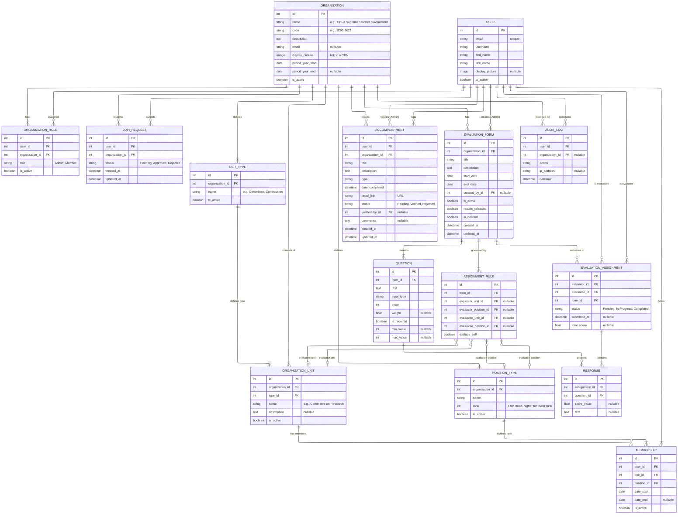

# Entity Relationship Diagram (ERD)

This document describes the database schema and entity relationships for the Individual Performance Evaluation System (IPES).

```mermaid
---
config:
    layout: elk
    look: handDrawn
---

erDiagram

    %% --- Org Structure ---

    ORGANIZATION {
        int id PK
        string name "e.g., CIT-U Supreme Student Government"
        string code "e.g., SSG-2025"
        text description
        string email "nullable"
        image display_picture "link to a CDN"
        date period_year_start
        date period_year_end "nullable"
        boolean is_active
    }
    ORGANIZATION_UNIT {
        int id PK
        int organization_id FK
        int type_id FK
        string name "e.g., Committee on Research"
        text description "nullable"
        boolean is_active
    }
    MEMBERSHIP {
        int id PK
        int user_id FK
        int unit_id FK
        int position_id FK
        date date_start
        date date_end "nullable"
        boolean is_active
    }
    ORGANIZATION_ROLE {
        int id PK
        int user_id FK
        int organization_id FK
        string role "Admin, Member"
        boolean is_active
    }
    JOIN_REQUEST {
        int id PK
        int user_id FK
        int organization_id FK
        string status "Pending, Approved, Rejected"
        datetime created_at
        datetime updated_at
    }

    %% LUT for ORG_UNIT
    UNIT_TYPE {
        int id PK
        int organization_id FK
        string name "e.g. Committee, Commission"
        boolean is_active
    }

    %% LUT for MEMBERSHIP
    POSITION_TYPE {
        int id PK
        int organization_id FK
        string name
        int rank "1 for Head, higher for lower rank"
        boolean is_active
    }

    ORGANIZATION ||--|{ UNIT_TYPE : "defines"
    ORGANIZATION ||--|{ POSITION_TYPE : "defines"
    ORGANIZATION ||--|{ ORGANIZATION_UNIT : "consists of"
    ORGANIZATION ||--o{ JOIN_REQUEST : "receives"
    ORGANIZATION ||--|{ ORGANIZATION_ROLE : "has"
    ORGANIZATION ||--o{ ACCOMPLISHMENT : "tracks"

    UNIT_TYPE ||--|{ ORGANIZATION_UNIT : "defines type"
    POSITION_TYPE ||--|{ MEMBERSHIP : "defines rank"

    ORGANIZATION_UNIT ||--o{ MEMBERSHIP : "has members"

    %% --- User ---

    USER {
        int id PK
        string email "unique"
        string username
        string first_name
        string last_name
        image display_picture "nullable"
        boolean is_active
    }
    ACCOMPLISHMENT {
        int id PK
        int user_id FK
        int organization_id FK
        string title
        text description
        string type
        datetime date_completed
        string proof_link "URL"
        string status "Pending, Verified, Rejected"
        int verified_by_id FK "nullable"
        text comments "nullable"
        datetime created_at
        datetime updated_at
    }

    USER ||--|{ MEMBERSHIP : "holds"
    USER ||--o{ JOIN_REQUEST : "submits"
    USER ||--o{ ACCOMPLISHMENT : "logs"
    USER ||--o{ ACCOMPLISHMENT : "verifies (Admin)"
    USER ||--o{ ORGANIZATION_ROLE : "assigned"

    %% --- Evaluation Structure ---

    EVALUATION_FORM {
        int id PK
        int organization_id FK
        string title
        text description
        date start_date
        date end_date
        int created_by_id FK "nullable"
        boolean is_active
        boolean results_released
        boolean is_deleted
        datetime created_at
        datetime updated_at
    }

    QUESTION {
        int id PK
        int form_id FK
        text text
        string input_type
        int order
        float weight "nullable"
        boolean is_required
        int min_value "nullable"
        int max_value "nullable"
    }

    ASSIGNMENT_RULE {
        int id PK
        int form_id FK
        int evaluator_unit_id FK "nullable"
        int evaluator_position_id FK "nullable"
        int evaluatee_unit_id FK "nullable"
        int evaluatee_position_id FK "nullable"
        boolean exclude_self
    }
    
    USER ||--o{ EVALUATION_FORM : "creates (Admin)"
    ORGANIZATION ||--o{ EVALUATION_FORM : "has"
    EVALUATION_FORM ||--|{ QUESTION : "contains"
    EVALUATION_FORM ||--|{ ASSIGNMENT_RULE : "governed by"

    ASSIGNMENT_RULE }o--o| ORGANIZATION_UNIT : "evaluator unit"
    ASSIGNMENT_RULE }o--o| POSITION_TYPE : "evaluator position"
    ASSIGNMENT_RULE }o--o| ORGANIZATION_UNIT : "evaluatee unit"
    ASSIGNMENT_RULE }o--o| POSITION_TYPE : "evaluatee position"

    %% --- Evaluation Assignment ---
    EVALUATION_ASSIGNMENT {
        int id PK
        int evaluator_id FK
        int evaluatee_id FK
        int form_id FK
        string status "Pending, In Progress, Completed"
        datetime submitted_at "nullable"
        float total_score "nullable"
    }

    USER ||--o{ EVALUATION_ASSIGNMENT : "is evaluator"
    USER ||--o{ EVALUATION_ASSIGNMENT : "is evaluatee"
    EVALUATION_FORM ||--o{ EVALUATION_ASSIGNMENT : "instances of"

    %% --- Responses ---
    RESPONSE {
        int id PK
        int assignment_id FK
        int question_id FK
        float score_value "nullable"
        text text "nullable"
    }

    EVALUATION_ASSIGNMENT ||--|{ RESPONSE : "contains"
    QUESTION ||--o{ RESPONSE : "answers"

    %% --- Audit ---
    
    AUDIT_LOG {
        int id PK
        int user_id FK
        int organization_id FK "nullable"
        string action
        string ip_address "nullable"
        datetime datetime
    }

    USER ||--o{ AUDIT_LOG : "generates"
    ORGANIZATION ||--o{ AUDIT_LOG : "recorded for"
```
