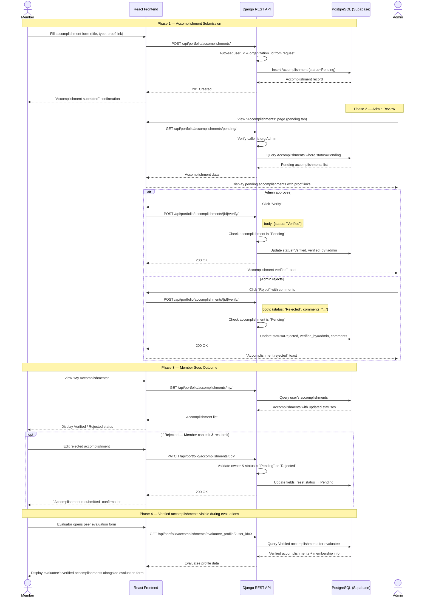

# Accomplishment Verification Sequence Diagram

This diagram shows how members submit accomplishments and how admins review (verify or reject) them.

```mermaid
sequenceDiagram
    actor Member
    participant Frontend as React Frontend
    participant API as Django REST API
    participant DB as PostgreSQL (Supabase)
    actor Admin

    Note over Member, DB: Phase 1 — Accomplishment Submission

    Member->>Frontend: Fill accomplishment form (title, type, proof link)
    Frontend->>API: POST /api/portfolio/accomplishments/
    API->>API: Auto-set user_id & organization_id from request
    API->>DB: Insert Accomplishment (status=Pending)
    DB-->>API: Accomplishment record
    API-->>Frontend: 201 Created
    Frontend-->>Member: "Accomplishment submitted" confirmation

    Note over Admin, DB: Phase 2 — Admin Review

    Admin->>Frontend: View "Accomplishments" page (pending tab)
    Frontend->>API: GET /api/portfolio/accomplishments/pending/
    API->>API: Verify caller is org Admin
    API->>DB: Query Accomplishments where status=Pending
    DB-->>API: Pending accomplishments list
    API-->>Frontend: Accomplishment data
    Frontend-->>Admin: Display pending accomplishments with proof links

    alt Admin approves
        Admin->>Frontend: Click "Verify"
        Frontend->>API: POST /api/portfolio/accomplishments/{id}/verify/
        Note right of API: body: {status: "Verified"}
        API->>API: Check accomplishment is "Pending"
        API->>DB: Update status=Verified, verified_by=admin
        API-->>Frontend: 200 OK
        Frontend-->>Admin: "Accomplishment verified" toast
    else Admin rejects
        Admin->>Frontend: Click "Reject" with comments
        Frontend->>API: POST /api/portfolio/accomplishments/{id}/verify/
        Note right of API: body: {status: "Rejected", comments: "..."}
        API->>API: Check accomplishment is "Pending"
        API->>DB: Update status=Rejected, verified_by=admin, comments
        API-->>Frontend: 200 OK
        Frontend-->>Admin: "Accomplishment rejected" toast
    end

    Note over Member, DB: Phase 3 — Member Sees Outcome

    Member->>Frontend: View "My Accomplishments"
    Frontend->>API: GET /api/portfolio/accomplishments/my/
    API->>DB: Query user's accomplishments
    DB-->>API: Accomplishments with updated statuses
    API-->>Frontend: Accomplishment list
    Frontend-->>Member: Display Verified / Rejected status

    opt If Rejected — Member can edit & resubmit
        Member->>Frontend: Edit rejected accomplishment
        Frontend->>API: PATCH /api/portfolio/accomplishments/{id}/
        API->>API: Validate owner & status is "Pending" or "Rejected"
        API->>DB: Update fields, reset status → Pending
        API-->>Frontend: 200 OK
        Frontend-->>Member: "Accomplishment resubmitted" confirmation
    end

    Note over Member, DB: Phase 4 — Verified accomplishments visible during evaluations

    Member->>Frontend: Evaluator opens peer evaluation form
    Frontend->>API: GET /api/portfolio/accomplishments/evaluatee_profile/?user_id=X
    API->>DB: Query Verified accomplishments for evaluatee
    DB-->>API: Verified accomplishments + membership info
    API-->>Frontend: Evaluatee profile data
    Frontend-->>Member: Display evaluatee's verified accomplishments alongside evaluation form
```
