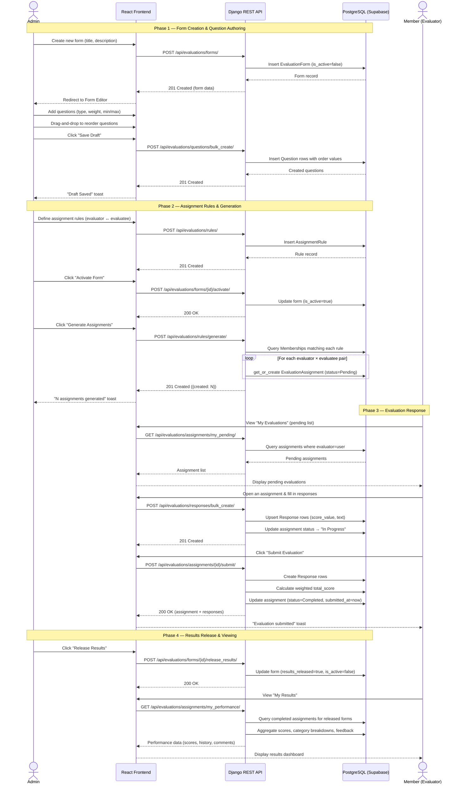

# Evaluation Form Lifecycle Sequence Diagram

This diagram illustrates the complete lifecycle of an evaluation form — from initial creation by an Admin, through question authoring, assignment generation, member response submission, and finally viewing results.

