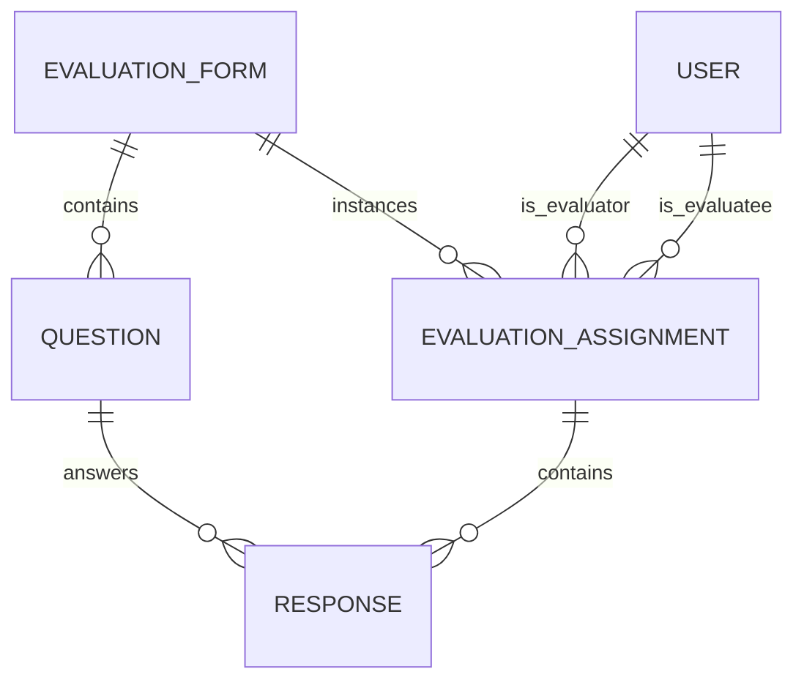
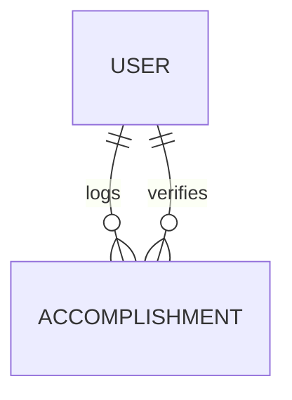
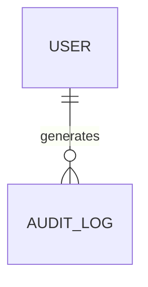

# Sprint 2 Implementation Plan: Evaluations, Portfolio, and Audit APIs

## Overview
Implement backend APIs for the three pending apps: **Evaluations**, **Portfolio**, and **Audit**. This plan covers ViewSets, Serializers, URL routing, and any necessary utility functions.

---

## 1. Evaluations API Implementation

### 1.1 Models Overview


### 1.2 Serializers to Create

#### `apps/evaluations/serializers.py`

**EvaluationFormSerializer**
- Fields: `id`, `organization_id`, `title`, `description`, `type`, `start_date`, `end_date`, `created_by`, `is_active`, `is_published`, `questions` (nested, read-only)
- Writeable fields: `organization_id`, `title`, `description`, `type`, `start_date`, `end_date`, `is_active`, `is_published`
- Custom actions: `publish()` - sets `is_published=True`

**EvaluationFormCreateSerializer**
- For creating forms with nested questions
- Nested serializer for questions

**QuestionSerializer**
- Fields: `id`, `form_id`, `text`, `input_type`, `order`, `weight`
- Input types: `rating`, `text`, `dropdown`, `checkbox`

**QuestionCreateSerializer**
- For bulk question creation during form creation

**EvaluationAssignmentSerializer**
- Fields: `id`, `evaluator_id`, `evaluatee_id`, `form_id`, `status`, `submitted_at`, `total_score`, `responses` (nested)
- Read-only: `total_score`, `submitted_at`

**ResponseSerializer**
- Fields: `id`, `assignment_id`, `question_id`, `score_value`, `text`
- Validation: Either `score_value` or `text` based on question type

**EvaluationSubmitSerializer**
- For submitting responses in bulk
- Nested responses with question validation

### 1.3 ViewSets to Create

#### `apps/evaluations/views.py`

**EvaluationFormViewSet** (ModelViewSet)
- `queryset = EvaluationForm.objects.all()`
- `serializer_class = EvaluationFormSerializer`
- `permission_classes = [IsAuthenticated]`
- Custom actions:
  - `create()` - Validate organization access
  - `publish()` - POST to `/forms/{id}/publish/`
  - `duplicate()` - POST to `/forms/{id}/duplicate/` - Copy form structure
  - `questions()` - GET `/forms/{id}/questions/` - List questions

**QuestionViewSet** (ModelViewSet)
- `queryset = Question.objects.all()`
- `serializer_class = QuestionSerializer`
- `permission_classes = [IsAuthenticated]`
- Custom actions:
  - `bulk_create()` - POST `/questions/bulk_create/`
  - `reorder()` - POST `/questions/{id}/reorder/` - Update order

**EvaluationAssignmentViewSet** (ModelViewSet)
- `queryset = EvaluationAssignment.objects.all()`
- `serializer_class = EvaluationAssignmentSerializer`
- `permission_classes = [IsAuthenticated]`
- Custom actions:
  - `submit()` - POST `/assignments/{id}/submit/` - Submit evaluation
  - `my_pending()` - GET `/assignments/my_pending/` - Get pending evaluations for current user
  - `by_form()` - GET `/assignments/by_form/?form_id=` - Get assignments for a form

**ResponseViewSet** (ModelViewSet)
- `queryset = Response.objects.all()`
- `serializer_class = ResponseSerializer`
- `permission_classes = [IsAuthenticated]`
- Custom actions:
  - `bulk_create()` - POST `/responses/bulk_create/`
  - `by_assignment()` - GET `/responses/by_assignment/?assignment_id=`

### 1.4 URL Routing

#### `apps/evaluations/urls.py`
```python
from django.urls import path, include
from rest_framework.routers import DefaultRouter
from .views import EvaluationFormViewSet, QuestionViewSet, EvaluationAssignmentViewSet, ResponseViewSet

router = DefaultRouter()
router.register(r'forms', EvaluationFormViewSet, basename='forms')
router.register(r'questions', QuestionViewSet, basename='questions')
router.register(r'assignments', EvaluationAssignmentViewSet, basename='assignments')
router.register(r'responses', ResponseViewSet, basename='responses')

urlpatterns = [
    path('', include(router.urls)),
]
```

### 1.5 API Endpoints Summary

| Endpoint | Methods | Description |
|----------|---------|-------------|
| `/api/evaluations/forms/` | GET, POST | List/create evaluation forms |
| `/api/evaluations/forms/{id}/` | GET, PUT, PATCH, DELETE | CRUD forms |
| `/api/evaluations/forms/{id}/publish/` | POST | Publish a form |
| `/api/evaluations/forms/{id}/duplicate/` | POST | Duplicate a form |
| `/api/evaluations/forms/{id}/questions/` | GET | List form questions |
| `/api/evaluations/questions/` | GET, POST | List/create questions |
| `/api/evaluations/questions/bulk_create/` | POST | Bulk create questions |
| `/api/evaluations/assignments/` | GET, POST | List/create assignments |
| `/api/evaluations/assignments/{id}/` | GET, PUT, PATCH, DELETE | CRUD assignments |
| `/api/evaluations/assignments/{id}/submit/` | POST | Submit evaluation |
| `/api/evaluations/assignments/my_pending/` | GET | Get pending evaluations |
| `/api/evaluations/responses/` | GET, POST | List/create responses |
| `/api/evaluations/responses/bulk_create/` | POST | Bulk create responses |

---

## 2. Portfolio API Implementation

### 2.1 Models Overview


### 2.2 Serializers to Create

#### `apps/portfolio/serializers.py`

**AccomplishmentSerializer**
- Fields: `id`, `user_id`, `title`, `description`, `type`, `date_completed`, `proof_link`, `status`, `verified_by`
- Read-only: `status`, `verified_by`, `user_id` (auto-set from request)
- Custom validation: `proof_link` must be valid URL

**AccomplishmentCreateSerializer**
- For users creating their own accomplishments
- Auto-set `user_id` from request.user

**AccomplishmentListSerializer**
- Extended serializer for list view
- Includes user name and verification status

**AccomplishmentVerifySerializer**
- For admins to verify accomplishments
- Fields: `status` (Verified/Rejected), `comments` (optional)

### 2.3 ViewSets to Create

#### `apps/portfolio/views.py`

**AccomplishmentViewSet** (ModelViewSet)
- `queryset = Accomplishment.objects.all()`
- `permission_classes = [IsAuthenticated]`
- Custom actions:
  - `my_accomplishments()` - GET `/accomplishments/my/` - Get current user's accomplishments
  - `pending_verification()` - GET `/accomplishments/pending/` - Get accomplishments awaiting verification (Admin)
  - `verify()` - POST `/accomplishments/{id}/verify/` - Verify/reject accomplishment (Admin)
  - `by_type()` - GET `/accomplishments/by_type/?type=` - Filter by type
  - `by_user()` - GET `/accomplishments/by_user/?user_id=` - Get accomplishments for specific user (Admin)

### 2.4 URL Routing

#### `apps/portfolio/urls.py`
```python
from django.urls import path, include
from rest_framework.routers import DefaultRouter
from .views import AccomplishmentViewSet

router = DefaultRouter()
router.register(r'accomplishments', AccomplishmentViewSet, basename='accomplishments')

urlpatterns = [
    path('', include(router.urls)),
]
```

### 2.5 API Endpoints Summary

| Endpoint | Methods | Description |
|----------|---------|-------------|
| `/api/portfolio/accomplishments/` | GET, POST | List/create accomplishments |
| `/api/portfolio/accomplishments/{id}/` | GET, PUT, PATCH, DELETE | CRUD accomplishments |
| `/api/portfolio/accomplishments/my/` | GET | Get my accomplishments |
| `/api/portfolio/accomplishments/pending/` | GET | Get pending verification (Admin) |
| `/api/portfolio/accomplishments/{id}/verify/` | POST | Verify/reject (Admin) |
| `/api/portfolio/accomplishments/by_type/` | GET | Filter by type |
| `/api/portfolio/accomplishments/by_user/` | GET | Get by user (Admin) |

---

## 3. Audit API Implementation

### 3.1 Models Overview


### 3.2 Serializers to Create

#### `apps/audit/serializers.py`

**AuditLogSerializer**
- Fields: `id`, `user_id`, `action`, `ip_address`, `datetime`
- Read-only: all fields
- Custom: Add `user_email` via source

### 3.3 ViewSets to Create

#### `apps/audit/views.py`

**AuditLogViewSet** (ReadOnlyModelViewSet)
- `queryset = AuditLog.objects.all()`
- `serializer_class = AuditLogSerializer`
- `permission_classes = [IsAdminUser]` - Admin only
- Custom actions:
  - `by_user()` - GET `/audit/by_user/?user_id=` - Get logs for specific user
  - `by_action()` - GET `/audit/by_action/?action=` - Filter by action type
  - `by_date()` - GET `/audit/by_date/?start_date=&end_date=` - Date range filter
  - `recent()` - GET `/audit/recent/` - Get recent logs (last 100)

### 3.4 URL Routing

#### `apps/audit/urls.py`
```python
from django.urls import path, include
from rest_framework.routers import DefaultRouter
from .views import AuditLogViewSet

router = DefaultRouter()
router.register(r'audit', AuditLogViewSet, basename='audit')

urlpatterns = [
    path('', include(router.urls)),
]
```

### 3.5 API Endpoints Summary

| Endpoint | Methods | Description |
|----------|---------|-------------|
| `/api/audit/audit/` | GET | List audit logs |
| `/api/audit/audit/{id}/` | GET | Get single audit log |
| `/api/audit/audit/by_user/` | GET | Filter by user |
| `/api/audit/audit/by_action/` | GET | Filter by action |
| `/api/audit/audit/by_date/` | GET | Date range filter |
| `/api/audit/audit/recent/` | GET | Get recent 100 logs |

### 3.6 Audit Logging Utility

Create `apps/audit/utils.py`:
```python
def log_action(user, action, request=None):
    """Helper function to create audit log entries"""
    ip_address = None
    if request:
        ip_address = get_client_ip(request)
    
    AuditLog.objects.create(
        user_id=user,
        action=action,
        ip_address=ip_address
    )
```

**Actions to Log**:
- `user.login` - User logged in
- `user.logout` - User logged out
- `form.created` - Evaluation form created
- `form.published` - Evaluation form published
- `evaluation.submitted` - Evaluation submitted
- `accomplishment.created` - Accomplishment submitted
- `accomplishment.verified` - Accomplishment verified/rejected

---

## 4. Implementation Tasks by Priority

### Phase 1: Core APIs (Day 1)
1. [ ] Create `apps/evaluations/serializers.py`
2. [ ] Implement `apps/evaluations/views.py` (EvaluationFormViewSet)
3. [ ] Implement `apps/evaluations/views.py` (QuestionViewSet)
4. [ ] Create `apps/evaluations/urls.py`
5. [ ] Test forms API with Django admin or Postman

### Phase 2: Assignment & Response APIs (Day 2)
6. [ ] Implement `apps/evaluations/views.py` (EvaluationAssignmentViewSet)
7. [ ] Implement `apps/evaluations/views.py` (ResponseViewSet)
8. [ ] Add evaluation submission logic with score calculation
9. [ ] Test assignments and responses API

### Phase 3: Portfolio API (Day 3)
10. [ ] Create `apps/portfolio/serializers.py`
11. [ ] Implement `apps/portfolio/views.py` (AccomplishmentViewSet)
12. [ ] Create `apps/portfolio/urls.py`
13. [ ] Add verification workflow
14. [ ] Test accomplishments API

### Phase 4: Audit API (Day 4)
15. [ ] Create `apps/audit/serializers.py`
16. [ ] Implement `apps/audit/views.py` (AuditLogViewSet)
17. [ ] Create `apps/audit/urls.py`
18. [ ] Create `apps/audit/utils.py`
19. [ ] Integrate logging into other apps

### Phase 5: Integration & Testing (Day 5)
20. [ ] Update `IPES/api.py` with new endpoints
21. [ ] Add permissions and validation
22. [ ] Test all APIs together
23. [ ] Document API endpoints

---

## 5. File Structure After Implementation

```
apps/
├── evaluations/
│   ├── __init__.py
│   ├── admin.py
│   ├── apps.py
│   ├── models.py          # Already exists
│   ├── serializers.py      # NEW
│   ├── urls.py            # NEW
│   ├── views.py           # UPDATE
│   ├── tests.py
│   └── migrations/
├── portfolio/
│   ├── __init__.py
│   ├── admin.py
│   ├── apps.py
│   ├── models.py          # Already exists
│   ├── serializers.py     # NEW
│   ├── urls.py            # NEW
│   ├── views.py           # UPDATE
│   ├── tests.py
│   └── migrations/
└── audit/
    ├── __init__.py
    ├── admin.py
    ├── apps.py
    ├── models.py          # Already exists
    ├── serializers.py     # NEW
    ├── urls.py            # NEW
    ├── utils.py           # NEW
    ├── views.py           # UPDATE
    ├── tests.py
    └── migrations/
```

---

## 6. Testing Strategy

### Unit Tests
- Model CRUD operations
- Serializer validation
- ViewSet permission checks
- Custom action logic

### Integration Tests
- Full evaluation workflow (form → assignment → response → score)
- Accomplishment submission and verification
- Audit logging integration

### Test Coverage Target: 80%

---

## 7. Dependencies & Requirements

No new packages needed. Uses existing:
- Django REST Framework
- Django permissions system
- Existing User and Organization models

---

## 8. Potential Challenges & Solutions

| Challenge | Solution |
|-----------|----------|
| Circular imports (evaluations → users → organizations) | Import User model via `settings.AUTH_USER_MODEL` |
| Score calculation logic | Create utility function in `evaluations/utils.py` |
| Bulk response submission | Use `ManyRelatedField` with nested serializer |
| Performance with large assignments | Add pagination to list views |

---

## 9. Rollout Plan

1. **Backend Only**: Implement all APIs with minimal frontend integration
2. **API Documentation**: Update `IPES/api.py` with new endpoints
3. **Frontend Tasks**: Create separate frontend implementation plan after backend complete
